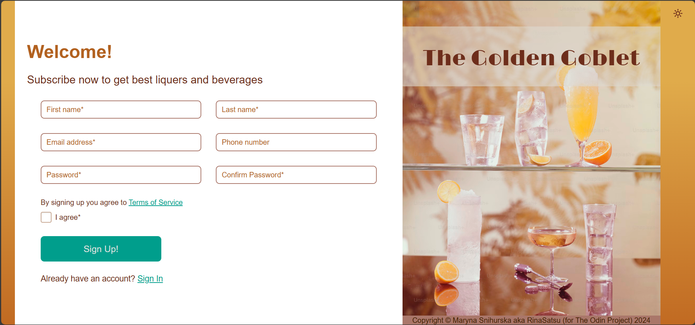

# Sign-Up Page

This project is a simple sign-up page built with HTML, CSS, and JavaScript. It was designed to practice creating visually appealing components using vanilla CSS and to deepen understanding of how CSS properties interact with one another.

## Purpose of the Project
The primary goal of this project was to practice:

- Creating and styling visual components using vanilla CSS.
- Ensuring flexibility and responsiveness with CSS Flexbox and Grid.
- Understanding how CSS properties interact and influence each other.
- Implementing JavaScript to enhance interactivity and functionality in web forms.

### Technologies Used:
**HTML:** Structure and layout of the form.

**CSS:** Styling and visual design, focusing on property interaction.

**JavaScript:** Input validation, theme toggle, and password visibility toggle.

## Features
**Input Validation:** Basic validation for user inputs to ensure proper data entry.

**Dark-Light Theme Toggle:** Switch between dark and light themes for a personalized user experience.

**Show-Hide Password Toggle:** Easily reveal or hide the password field's content for better usability.

### Disclaimer:
This project is for demonstration purposes only.

**No Submission:** The form does not submit any data; it serves as an example of front-end design and functionality.

**Static Links:** All links are plain text for demonstration purposes and will not perform any actions when clicked.

## How to Use
1. Visit the website where the Sign-In page is hosted **OR** Clone or download the repository and open the HTML file in your browser.
2. Interact with the form to test the input validation and toggles.
3. Use the theme toggle switch to explore the dark and light themes.
4. Experiment with the show/hide password feature to see your input dynamically.

## Feedback and Issues
If you encounter any issues with this Sign-In page or have suggestions for improvements, please open an issue on the GitHub repository. Your feedback is valuable and will help make this project even better.

### Credits
This project was created with passion by  Maryna Snihurska (aka RinaSatsu). Special thanks to The Odin Project for their idea of this project.

Feel free to explore and adapt the project to suit your needs!
